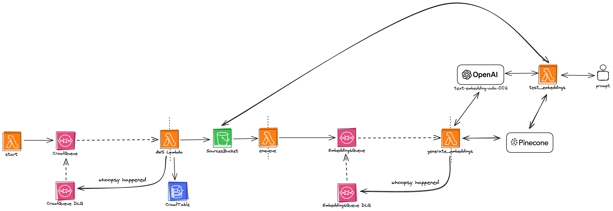

<!--
title: 'AWS Python Example'
description: 'This template demonstrates how to deploy a Python function running on AWS Lambda using the traditional Serverless Framework.'
layout: Doc
framework: v3
platform: AWS
language: python
priority: 2
authorLink: 'https://github.com/serverless'
authorName: 'Serverless, inc.'
authorAvatar: 'https://avatars1.githubusercontent.com/u/13742415?s=200&v=4'
-->


# Serverless Crawl & Embed - Serverless Framework AWS

This was generated using the Serverless Framework AWS Python template. 

This is an example of a way to crawl, generate and store embeddings static websites in using an S3 bucket, Lambdas, SQS, DynamoDB, Pinecone(Serverless) and OpenAI(text-embedding-ada-002).

## Plugins
- serverless-python-requirements
- serverless-lift

## Architecture


## Requirements
- Docker
- NPM

## Usage

Install the Serverless Framework:

```bash
npm install -g serverless
```

Install the dependencies:

```bash
npm install
```

Add your environment variables to a `.env` file in the root of the project. 

```bash
cp .env.local .env.dev
cp .env.local .env
```

### Deployment

In order to deploy the example, you need to run the following command:

```
$ serverless deploy
```

After running deploy, you should see output similar to:

```bash
Deploying serverless-crawl-embed to stage dev (us-east-1)

✔ Service deployed to stack serverless-crawl-embed-dev (68s)

functions:
  start: serverless-crawl-embed-dev-start (23 MB)
  enqueue: serverless-crawl-embed-dev-enqueue (23 MB)
  testEmbeddings: serverless-crawl-embed-dev-testEmbeddings (23 MB)
  CrawlQueueWorker: serverless-crawl-embed-dev-CrawlQueueWorker (23 MB)
  EmbeddingsQueueWorker: serverless-crawl-embed-dev-EmbeddingsQueueWorker (23 MB)
CrawlQueue: https://sqs.us-east-1.amazonaws.com/....
CrawlTable: serverless-crawl-embed-dev-CrawlTable...
SourcesBucket: serverless-crawl-embed-dev-sourcesbucket...
EmbeddingsQueue: https://sqs.us-east-1.amazonaws.com/...
```

### Invocation

After successful deployment, you can invoke the deployed `start` function to crawl a site by using the following command:

```bash
sls invoke -f start --data "https://nextjs.org"  
```

Then you can test by invoking the  `test_embedding` function:

```bash
sls invoke -f testEmbeddings --data "what is nextjs?"  
```

Which should result in response similar to the following:

```json
{
    "matches": [
        {
            "id": "raw/nextjs.org/index.html#chunk0",
            "score": 0.874210715,
            "values": [],
            "metadata": {
                "chunk_index": 0,
                "s3_key": "raw/nextjs.org/index.html",
                "source_url": "https://nextjs.org/",
                "text": "Used by some of the world's largest companies, Next.js enables you to create high-quality web applications with the power of React components. Everything you need to build great products on the web. Deploy Next.js to Vercel. Vercel is a frontend cloud from the creators of Next.js, making it easy to get started with Next.js quickly. Jumpstart your Next.js development with pre-built solutions from Vercel and our community. Next.js Boilerplate. A Next.js app and a Serverless Function API. Image Gallery Starter. An image gallery built on Next.js and Cloudinary. Next.js Commerce. An all-in-one starter kit for high-performance ecommerce sites. For performance, efficiency and developer experience. Next.js is trusted by some of the biggest names on the web. Stay updated on new releases and features, guides, and case studies. © 2024 Vercel, Inc."
            }
        }
}
```

### Bundling dependencies

In case you would like to include third-party dependencies, you will need to use a plugin called `serverless-python-requirements`. You can set it up by running the following command:

```bash
serverless plugin install -n serverless-python-requirements
```

Running the above will automatically add `serverless-python-requirements` to `plugins` section in your `serverless.yml` file and add it as a `devDependency` to `package.json` file. The `package.json` file will be automatically created if it doesn't exist beforehand. Now you will be able to add your dependencies to `requirements.txt` file (`Pipfile` and `pyproject.toml` is also supported but requires additional configuration) and they will be automatically injected to Lambda package during build process. For more details about the plugin's configuration, please refer to [official documentation](https://github.com/UnitedIncome/serverless-python-requirements).
